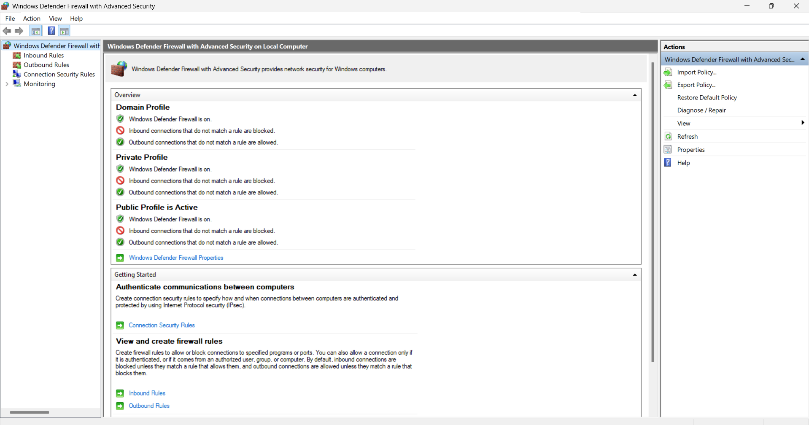
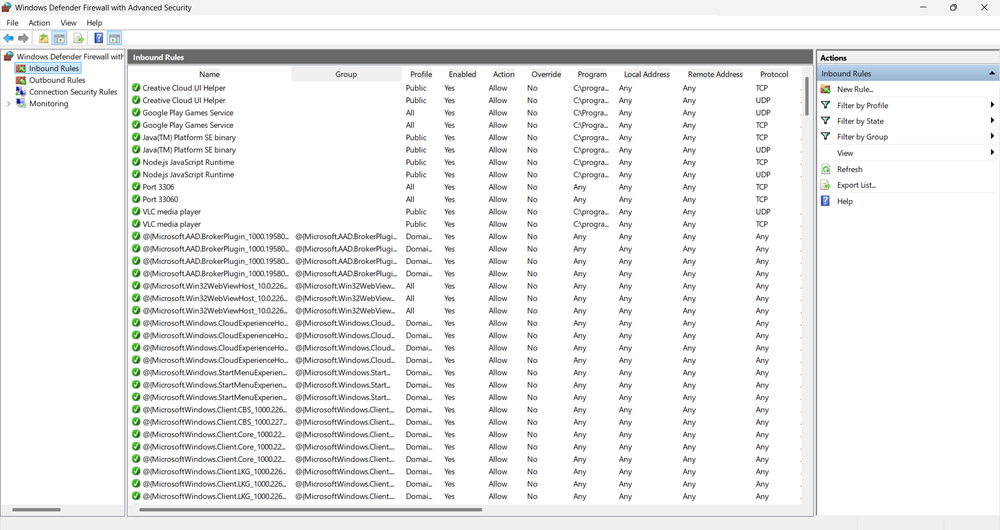
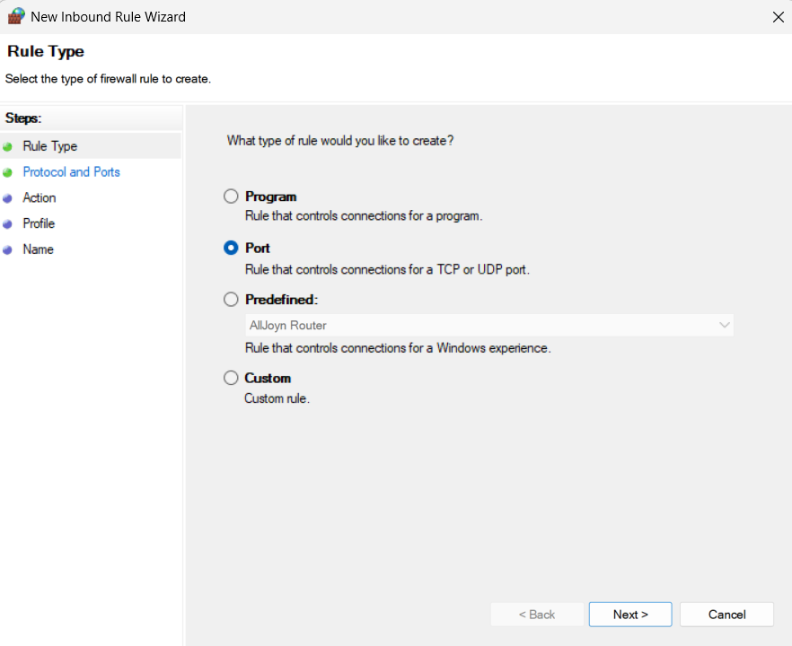
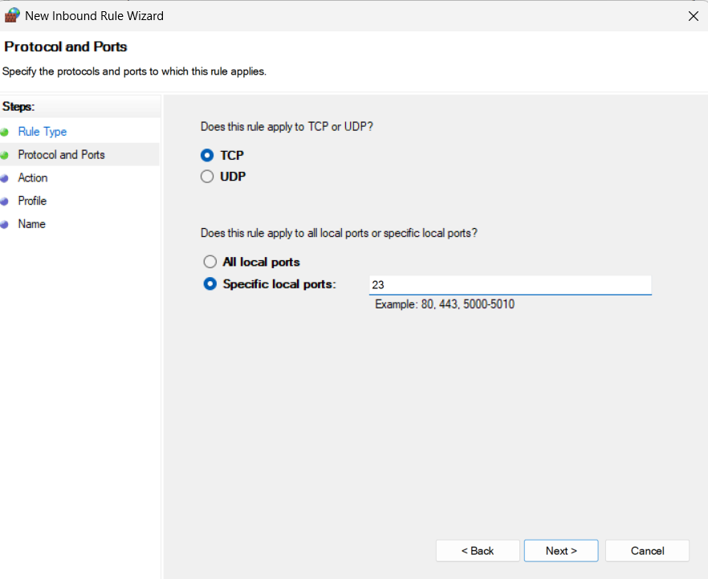
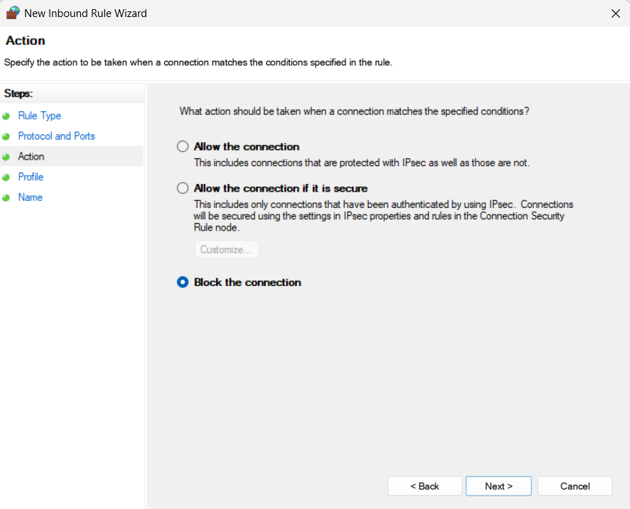
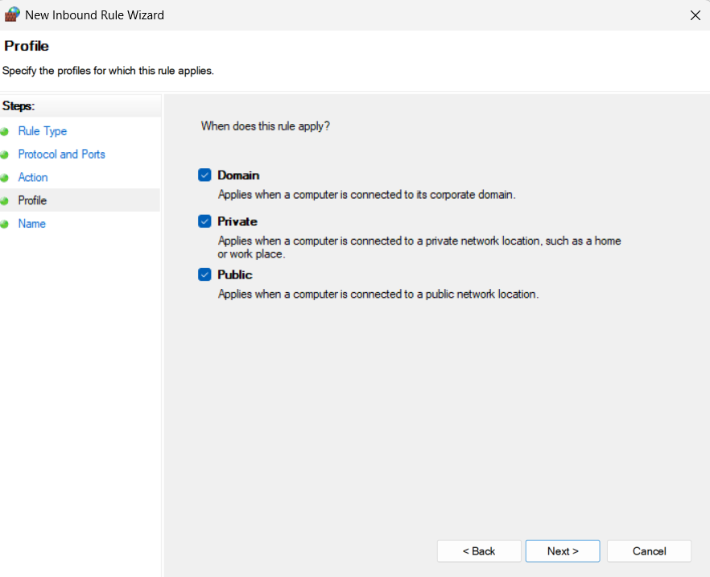
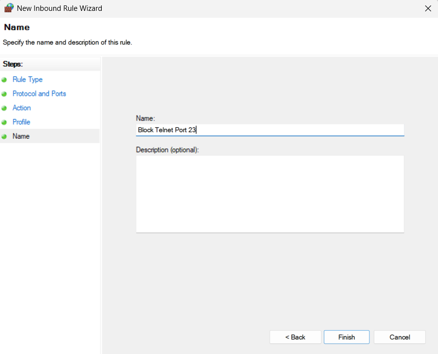
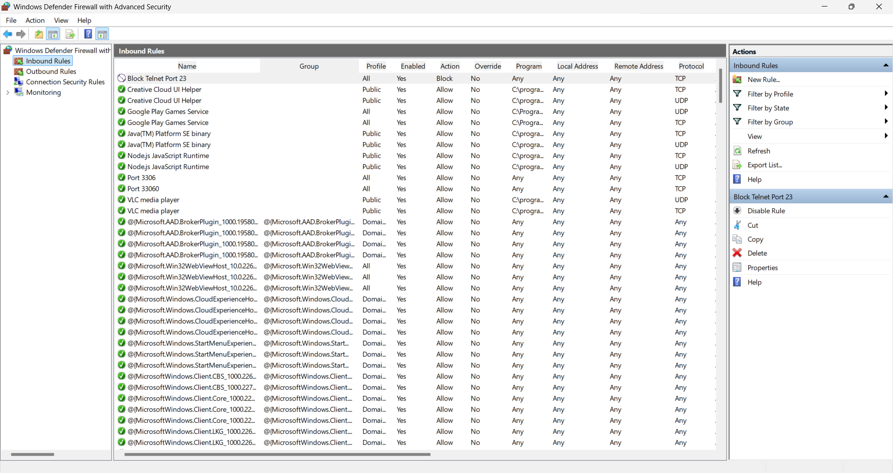
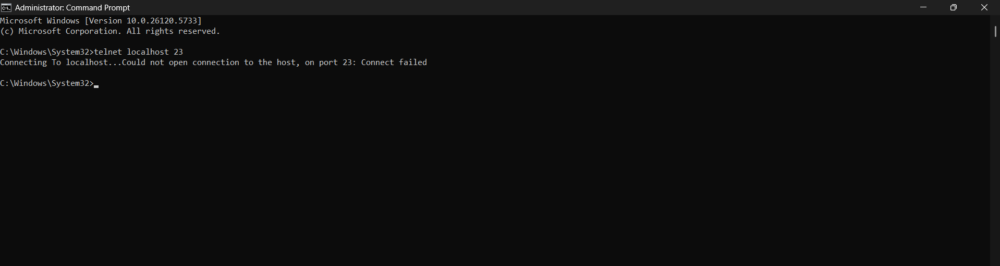
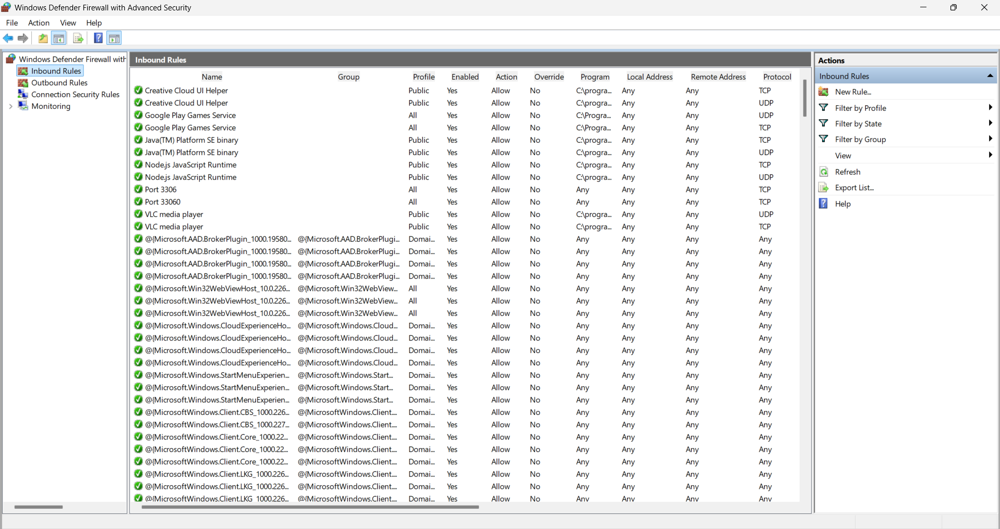

# Task 4 – Firewall Configuration

## Objective
Configure and test basic firewall rules in Windows 11 to allow or block network traffic.

## Tools Used
- **OS**: Windows 11 Home
- **Tool**: Windows Defender Firewall with Advanced Security

## Steps Performed

1. **Opened Windows Defender Firewall with Advanced Security**  
   

2. **Checked existing inbound rules (before any changes)**  
   

3. **Created a New Inbound Rule – Selected Port type**  
   

4. **Chose TCP and specified port 23**  
   

5. **Selected "Block the connection" action**  
   

6. **Applied the rule to Domain, Private, and Public profiles**  
   

7. **Named the rule as Block Telnet Port 23**  
   

8. **Verified the rule appeared in inbound rules**  
   

9. **Tested blocking by attempting a Telnet connection to localhost on port 23 (failed to connect)**  
   

10. **Removed the port 23 blocking rule to restore the original state**  
    

## Learning Outcomes
- Learned how to block specific ports on Windows Firewall.
- Understood inbound rules, profiles, and traffic blocking.
- Verified rules with practical testing.

## Screenshots
All screenshots are located in the `/screenshots` folder and are mapped to each step above.

---

> Task successfully completed as part of the Elevate Labs Cyber Security Internship Program.
